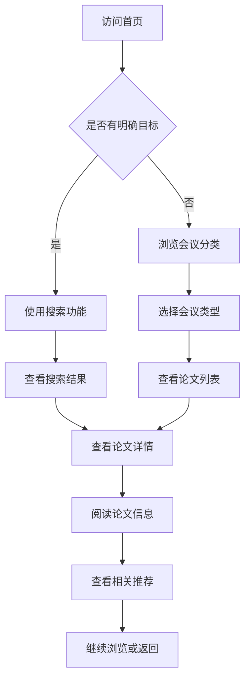

# 临床试验统计编程知识库 - 产品需求文档

## 1. 产品概述

临床试验统计编程知识库是一个专注于SAS编程、CDISC标准、临床数据管理及相关领域的专业资源聚合平台。知识库汇集PharmaSUG、PharmaRug、CDISC、CMAC等行业会议的技术论文、演示文稿和会议记录，为生物统计程序员、临床数据管理员和生物统计师提供一站式学习和参考资料库。

**核心价值**：整合分散的行业会议资源，提供高效的检索和浏览体验，降低专业内容获取门槛。

**目标用户**：
- 临床试验SAS程序员
- 生物统计师
- 临床数据管理员
- 临床研究协调员
- 制药企业研发人员

## 2. 核心功能

### 2.1 功能模块

1. **首页展示**
   - 知识库介绍与导航
- 最新会议资料展示
   - 热门/精选论文推荐
   - 快速搜索入口

2. **会议资料库**
   - 按会议年份/名称分类浏览
   - 支持的会议：PharmaSUG (US/EU)、PharmaRug、CDISC、CMAC
   - 论文列表展示（标题、作者、摘要、标签）

3. **资料详情页**
   - 论文完整信息（标题、作者、摘要、关键词）
   - 相关会议信息
   - 相关推荐

4. **搜索与筛选**
   - 关键词全文搜索
   - 按会议名称筛选
   - 按年份筛选
   - 按主题/标签筛选（CDISC、SDTM、ADaM、SAS宏、统计编程等）

### 2.2 页面结构

| 页面名称 | 模块名称 | 功能描述 |
|---------|---------|---------|
| 首页 | Hero区域 | 知识库品牌展示、快速搜索 |
| 首页 | 会议导航 | PharmaSUG/PharmaRug/CDISC/CMAC四大会议入口 |
| 首页 | 最新资料 | 展示最新收录的论文资料卡片 |
| 首页 | 热门标签 | 展示CDISC、SDTM、ADaM等热门技术标签 |
| 会议列表页 | 侧边筛选栏 | 按年份、会议类型、主题标签筛选 |
| 会议列表页 | 论文卡片列表 | 展示论文标题、作者、摘要预览 |
| 详情页 | 论文信息区 | 完整标题、作者、摘要、关键词 |
| 详情页 | 会议信息区 | 会议名称、届次、时间 |
| 详情页 | 相关推荐 | 同会议或同标签的其他论文 |

## 3. 核心流程

### 3.1 用户浏览流程

### 3.2 数据维护流程

知识库数据来源于行业公开会议资料，主要通过以下方式获取：
- 解析PharmaSUG会议官网的会议论文列表
- 解析PharmaRug会议官网资料
- 解析CDISC官网资源
- 解析CMAC会议资料

数据存储使用静态JSON文件，支持手动更新和维护。

## 4. 用户界面设计

### 4.1 设计风格

**设计理念**：专业、简洁、学术气质
**配色方案**：
- 主色：深蓝色 #1E3A5F（代表专业、信赖）
- 辅色：浅灰色 #F5F7FA（背景）
- 强调色：青绿色 #0D9488（链接、按钮）
- 文字色：深灰 #1F2937

**字体选择**：
- 标题：Source Serif Pro（学术感）
- 正文：Noto Sans SC（中文清晰易读）

**布局风格**：卡片式布局，清晰的导航层次

### 4.2 组件样式

- **卡片组件**：白色背景，轻微阴影，边框圆角8px
- **按钮**：主要按钮青绿色，次要按钮边框样式
- **标签**：胶囊形状，浅色背景配合深色文字
- **搜索框**：带图标的圆角输入框

### 4.3 响应式设计

- 桌面端优先设计
- 平板：两列卡片布局
- 移动端：单列布局，折叠导航

## 5. 技术架构

- **前端框架**：React 18 + Vite
- **样式方案**：Tailwind CSS
- **路由管理**：React Router
- **数据存储**：静态JSON数据文件
- **部署方案**：GitHub Pages
